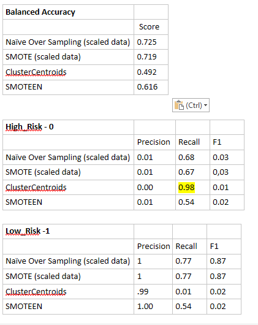

# SupervisedMachineLearning
Supervised Machine Learning and Credit Risk. Predicting credit risk with machine learning models using Python.

### Module 17 Challenge

**Main Objective:** Given application loan data for 2019 Q1 for a fictional bank; use various resampling techniques with logistical regression and compare the performance of the resampling techniques in predicting whether the loan applications are low or high risk.

**Data Encoding:**  Encoded eleven text fields, including the target field of "loan_status" with the LableEncoder. 

**Data Scaling:**  While not in the challenge instructions, I scaled the X data using the sklearn Standard Scaler. 

*This had interesting results.* Overall the model performances for Naive Random Over Sampling and for SMOTE sampling improved when using scaled data. However running the resampling for both the Under Sampling (ClusterCentroids) and the Combination (SMOTEENN)  did not complete within an hour on my computer. 

So, the analysis is done using scaled data for the first two techniques, but non scaled data for the the last two techniques.

**Summary of Comparison of Sampling Techniques:** 

As shown below in the Balanced Accuracy table both the NAIVE and  SMOTE techniques produced respectable balanced accuracy scores of 0.7.  This appears to be promising for these models. These two models are using scaled data.

**Predicting Low Risk**  In the comparison of precision, all the models are scoring perfect, or nearly perfect in predicting Low Risk applications, so really any models is useful for predicting Low Risk. However the Recall score for SMOTEEN is poor and ClusterCentroids is terrible, which means you can't can't on these two techniques to predict all of your low risk loans.

**Predicting High Risk** Predicting High Risk is terrible for three of the models, as their precision is all under .02 and their Recall scores are bad. 

Interestingly, the ***ClusterCentroids*** technique does have a near perfect Recall score. Its Precision, F1, and Balanced Accuracy are poor but this model does appear to be very useful in predicting High-Risk applications. Unfortunately its horrible precision score means it has a terrible False positive rate

**Overall Summary**** Predicting Low Risk can best be done with either the Naive or SMOTE technique. However neither of these four techniques, alone,  should be used for predicting High Risk.

It may be useful to try other models, such as Random  Forest, to find a reliable High Risk evaluator.

